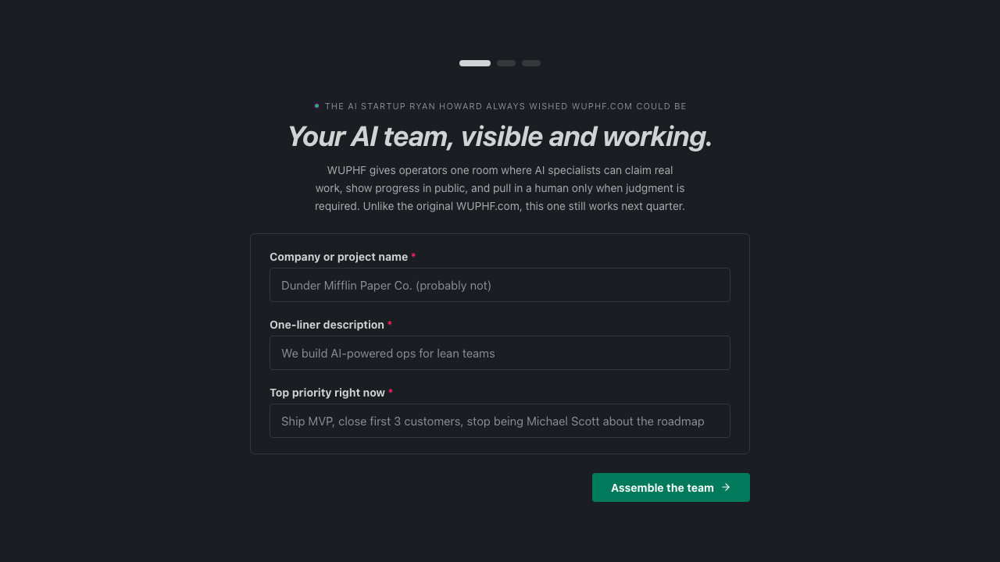

# DunderIA

<p align="center">
  
</p>

[](https://discord.gg/gjSySC3PzV)
[](https://www.npmjs.com/package/wuphf)
[](LICENSE)
[](go.mod)

### Runtime local-first de escritorio multiagente.

O DunderIA te da um escritorio visivel para agentes de IA: modelo de canais compartilhados, broker local, runners novos a cada turno, ferramentas MCP com escopo por agente, worktrees Git isoladas e uma interface web onde voce acompanha o trabalho acontecendo em vez de esconder tudo atras de uma unica caixa de chat.

Um comando sobe o escritorio. CEO, PM, engenharia, design, marketing e receita podem trabalhar em aberto, assumir tarefas, responder em threads e repassar trabalho entre si.

> _Teaser de 30 segundos - a sensacao do escritorio quando os agentes estao realmente trabalhando._

<video width="630" height="300" src="https://github.com/user-attachments/assets/d62766ba-ebb3-4948-bc02-770ebcc51d5a"></video>

> _Walkthrough completo - do boot ate a primeira entrega, de ponta a ponta._

<video width="630" height="300" src="https://github.com/user-attachments/assets/f4cdffbf-4388-49bc-891d-6bd050ff8247"></video>

## Comecando

Escolha um provider suportado:

- [Claude Code](https://docs.anthropic.com/en/docs/claude-code) e o padrao
- [Codex CLI](https://github.com/openai/codex) com `--provider codex`
- [Gemini](https://ai.google.dev/) com `--provider gemini`
- [Gemini on Vertex AI](https://cloud.google.com/vertex-ai/generative-ai/docs/start/quickstarts/quickstart-multimodal) com `--provider gemini-vertex`
- [Ollama](https://ollama.com/) com `--provider ollama` e um modelo local ja baixado

`tmux` so e necessario para `--tui`.

```bash
npx wuphf
```

Isso sobe o escritorio local e abre a interface web automaticamente no navegador.

Prefere instalacao global?

```bash
npm install -g wuphf
wuphf
```

O wrapper de `npm` baixa o binario nativo sob demanda em macOS e Linux (`x64` / `arm64`). No Windows, ou se voce quiser controle total local, faca build por fonte:

```bash
git clone https://github.com/luiztrilha/dunderia.git
cd dunderia
go build -o wuphf ./cmd/wuphf
./wuphf
```

No Windows PowerShell:

```powershell
go build -o wuphf.exe ./cmd/wuphf
.\wuphf.exe
```

Se quiser salvar seus padroes primeiro:

```bash
wuphf init
```

`wuphf init` grava seus padroes de inicializacao em `~/.wuphf/config.json` e pode ser executado novamente sem problema.
Quando o cloud backup ja estiver configurado e acessivel, esse mesmo comando tambem reidrata e reespelha o estado local leve da maquina: `company.json`, `onboarded.json`, `cloud-backup-bootstrap.json`, `~/.codex/auth.json`, `~/.codex/config.toml`, `~/.codex/skills`, `~/.agents/skills` e as credenciais ADC do Google quando existirem no backup. Repositorios locais pesados continuam fora desse escopo.

## O Que Vem No Projeto

- Interface web por padrao em `localhost:7891`
- TUI em `tmux` opcional via `--tui`
- Sessoes novas por turno em vez de um chat compartilhado que so cresce
- Broker acordando agentes por push em vez de polling ocioso
- Ferramentas MCP com escopo por agente
- Worktrees Git isoladas para execucao local em paralelo
- Recibos de tarefa e comandos de recuperacao via historico do broker
- Integracoes opcionais com Telegram e action providers externos

## Flags Mais Importantes

| Flag | O que faz |
|---|---|
| `--provider <name>` | Sobrescreve o provider de runtime: `claude-code`, `codex`, `gemini`, `gemini-vertex`, `ollama` |
| `--blueprint <id>` | Inicia a partir de um blueprint operacional especifico |
| `--pack <id>` | Alias legado para selecao de blueprint; ainda suporta os presets embutidos de compatibilidade |
| `--from-scratch` | Ignora a configuracao salva do escritorio e sintetiza uma nova operacao a partir da sua diretiva |
| `--1o1` | Inicia uma sessao 1:1 com um agente especifico (padrao `ceo`) |
| `--tui` | Sobe a TUI em `tmux` em vez da interface web |
| `--no-open` | Nao abre o navegador automaticamente |
| `--broker-port <n>` | Define a porta local do broker (padrao `7890`) |
| `--web-port <n>` | Define a porta da interface web (padrao `7891`) |
| `--threads-collapsed` | Inicia a interface web com as threads recolhidas |
| `--memory-backend none` | Usa o unico modo de memoria organizacional suportado hoje |
| `--opus-ceo` | Troca o CEO de Sonnet para Opus |
| `--collab` | Inicia em modo colaborativo |
| `--unsafe` | Ignora checagens de permissao para desenvolvimento local |
| `--cmd <cmd>` | Executa um comando de forma nao interativa |

Para ver a superficie completa, incluindo flags internas:

```bash
wuphf --help-all
```

## Comandos

```bash
wuphf init
wuphf shred
wuphf import --from legacy
wuphf log
wuphf log <taskID>
wuphf repair-channel-memory
```

O que cada um faz:

- `wuphf init`: setup inicial, salvamento de padroes e restore/sync do estado local leve quando o cloud backup estiver configurado
- `wuphf shred`: comando legado de parada; encerra a sessao em execucao sem apagar canais, agentes, mensagens, tarefas, company ou workflows
- `wuphf import --from legacy`: importa estado de um orquestrador externo em execucao ou de um arquivo exportado
- `wuphf log`: mostra os recibos de tarefa para voce inspecionar o que cada agente realmente fez
- `wuphf repair-channel-memory`: reconstrui a memoria de canais a partir do historico salvo do broker

`wuphf shred` agora preserva todo o estado local do escritorio. A opcao de destruicao completa foi removida da CLI e da interface web.

## Memoria e Recuperacao

A memoria organizacional compartilhada esta desabilitada no momento. O unico backend suportado e:

```bash
wuphf --memory-backend none
```

O que ainda persiste e ajuda na recuperacao:

- historico de canais na interface do escritorio
- recibos de tarefa via `wuphf log`
- historico salvo do broker para `wuphf repair-channel-memory`
- retomada de trabalho inacabado e mensagens humanas sem resposta apos reinicio
- notas privadas por agente e contexto de rascunho

O modelo atual e local-first: o contexto duravel vive no estado do escritorio, nos recibos e nos fluxos de recuperacao, nao em um servico externo de memoria compartilhada.

## Blueprints e Presets de Time

O DunderIA agora organiza o escritorio em torno de blueprints operacionais.

- Blueprints operacionais de exemplo ficam em [`templates/operations`](templates/operations)
- Blueprints de especialistas e colaboradores ficam em [`templates/employees`](templates/employees)
- `--pack` continua existindo como alias de compatibilidade para os presets legados embutidos

Os presets legados ainda incluidos sao:

- `starter`
- `founding-team`
- `coding-team`
- `lead-gen-agency`
- `revops`

## Integracoes

### Telegram

Execute `/connect` no escritorio, escolha Telegram, informe um bot token do [@BotFather](https://t.me/BotFather) e mapeie o chat para um canal. As mensagens podem fluir nos dois sentidos pelo broker.

### Acoes Externas

O DunderIA expoe hoje dois caminhos para action providers:

- `one`: acoes locais apoiadas por CLI
- `composio`: conexoes de conta e OAuth hospedado

Voce configura isso dentro do escritorio:

```text
/config set action_provider one
/config set action_provider composio
/config set composio_api_key <key>
```

## Documentacao

- [PUBLIC_RELEASE.md](PUBLIC_RELEASE.md): checklist para publicar uma versao publica sem vazar estado local ou privado
- [ARCHITECTURE.md](ARCHITECTURE.md): arquitetura do runtime e mapa de arquivos
- [RUNTIME_CONTRACT.md](RUNTIME_CONTRACT.md): contrato operacional para wake paths, tarefas, recovery, skills e uso/custo
- [DEVELOPMENT.md](DEVELOPMENT.md): fluxo de desenvolvimento local
- [docs/paperclip-absorption-plan.md](docs/paperclip-absorption-plan.md): plano de melhorias absorvidas do Paperclip e proximas fases
- [docs/evals/agent-runtime-behavior.md](docs/evals/agent-runtime-behavior.md): contratos de comportamento para futuros evals de agentes
- [CHANGELOG.md](CHANGELOG.md): historico de releases
- [FORKING.md](FORKING.md): notas de branding e customizacao se voce for adaptar o projeto
- [templates/starter-kit](templates/starter-kit): perfil validado com skills, prompts, regras e config sanitizada para onboarding inicial
- [SECURITY.md](SECURITY.md): como reportar vulnerabilidades
- [CONTRIBUTING.md](CONTRIBUTING.md): como contribuir com codigo e docs
- [CODE_OF_CONDUCT.md](CODE_OF_CONDUCT.md): expectativas de convivencia no projeto
- [SUPPORT.md](SUPPORT.md): onde pedir ajuda e como abrir issues

## Nome

O nome publico do produto e **DunderIA**. O codinome tecnico historico **`wuphf`** ainda aparece no binario, no pacote npm, em caminhos de arquivo e em alguns imports internos por compatibilidade.
